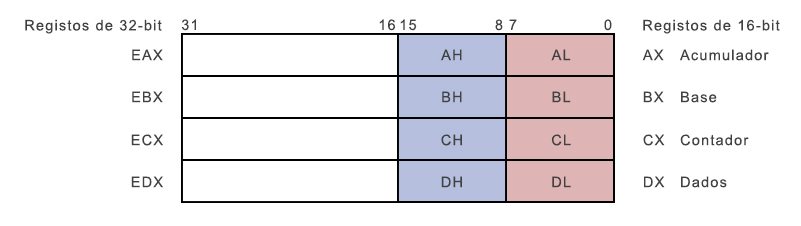

# Registos

As operações do processador envolvem principalmente o processamento de dados. Estes dados podem ser armazenados na memória e acedidos a partir daí. No entanto, a leitura e armazenamento de dados em memória retarda o processador, uma vez que envolve processos complicados de enviar o pedido através do barramento e para a unidade de armazenamento de memória e obter os dados através do mesmo canal.

Para acelerar as operações do processador, o processador inclui alguns locais de armazenamento de memória internos, chamados **registos**.

Os registos armazenam elementos de dados para o processador sem ter que aceder à memória. Um número limitado de registos estão incorporados ao chip do processador.

## Registos do Processador

Existem dez registos de 32-bit e seis de 16-bit na arquitetura IA-32. Os registos estão agrupados tem três categorias:

* Registos de uso geral,
* Registos de controlo, e
* Registos de segmento.

Os registos de processamento geral ainda estão divididos nos seguintes grupos:

* Registos de dados,
* Registos de ponteiro, e
* Registos de índice.

### Registos de Dados

Quatro registos de dados de 32-bit são usados para operações aritméticas, lógicas, e para outras operações. Esses registos podem ser usados de três maneira:

* Como registos completos de 32-bit: `EAX`, `EBX`, `ECX`, `EDX`.
* As metades inferiores dos registos de 32-bit podem ser usados como quatro registos de 16-bit: `AX`, `BX`, `CX`, `DX`.
* As metades mais baixas e mais altas dos registos de 16-bit falamos acima podem ser usados para armazenar dados de 8-bit: `AH`, `AL`, `BH`, `BL`, `CH`, `CL`, `DH` e `DL`.

Alguns destes registos têm usos específicos em algumas operações aritméticas.

**O AX é o acumulador primário**; Ele é usado no input/output na maioria das operações aritméticas. Por exemplo, na operação de multiplicação, um operando é armazenado no registo EAX ou AX ou AL de acordo com o tamanho do operando.

**O BX é conhecido como o registo de base**, uma vez que pode ser utilizado endereçar índices.

**O CX é conhecido como o registo de contagem**, tanto o ECX como o CX, eles armazenam o contador em operações iterativas.

**O DX é conhecido como o registo de dados**. Também é utilizado em operações de input/output. Ele também é usado com o registo AX juntamente com o DX para operações de multiplicação e divisão envolvendo grandes valores.

### Registos Ponteiros

Os registos ponteiros são de registos de 32-bit EIP, ESP e EBP e os seus correspondentes em 16-bit são IP, SP e BP. Existem três categorias de registos apontadores:

* **Instruction Pointer (IP)** - Este registo contem o 16-bit do endereço de offset (deslocamento) da próxima instrução a ser executada. O IP em associação com o registo CS (como CS:IP) dá o endereço completo da instrução no segmento de código.

* **Stack Pointer (SP)** - O registo SP de 16-bit fornece o valor de deslocamento dentro da *stack* do programa. O SP em associação com o registo SS (SS:SP) refere-se a posição atual dos dados ou do endereço no interior da *stack* do programa.

* **Base Pointer (BP)** - O registo de 16-bit BP ajuda principalmente a referenciar as variáveis passados por parâmetro a uma sub-rotina. O Endereço no registo SS combinado com o *offset* em BP obtém-se a localização do parâmetro. O BP também pode ser combinado com o DI e o SI como base para operações de endereçamento especiais.

### Registos de Índice

Os registos de índice de 32-bit são o ESI e o EDI, os seus 16-bit mais à direita são o SI e o DI. O Si e o DI, são usados endereçamento indexado e às vezes também são usados na adição e subtração. Há dois conjuntos de ponteiros de índice:

* **Source Index (SI)** - Ele é usado como índice da fonte de dados a copiar.

* **Destination Index (DI)** - Ele é usado como índice do destino dos dados a copiar.

## Registos de Controlo

Quando se combina os 32-bit dos registos de ponteiros com 32-bit dos registos de *flags* obtém-se os registos de controlo.

Muitas instruções envolvem comparações e cálculos matemáticos, alteração de estados das *flags* e outras instruções condicionais testam os valores do estado dessas *flags* para direcionar o fluxo de execução para outro local.

As *flags* mais comuns são:

* **Overflow Flag (OF)** - Ela indica se ocorreu um *overflow* de um bit mais significativo dos dados após uma dada operação aritmética.

* **Direction Flag (DF)** - Ela determina em que direção uma *string* é comparada. Se o seu valor for definido para 0, a operação de comparação irá seguir uma direção da esquerda para a direita Quando definido para 1, a comparação irá ser efetuada da direita para a esquerda.

* **Interrupt Flag (IF)** - Esta *flag* define se as interrupções externas, tais como o teclado, serão processadas ou ignoradas. O estado 0 corresponde a ignorar as interrupções externas e ativado quando definida a 1.

* **Trap Flag (TF)** - Ela permite definir o modo de operação do processador para *single-step*. Isto permite que um programa de *DEBUG* ative esta *flag* e assim é possível avançar a execução através de uma instrução de cada vez.

* **Sign Flag (SF)** - Ela mostra o sinal do resultado de uma operação aritmética. Esta *flag* é definido de acordo com o sinal dos dados de uma operação aritmética. O sinal é indicado pela bit mais significativo. Um resultado positivo limpa o valor de SF a 0 e um resultado negativo define -o como 1.

* **Zero Flag (ZF)** - Ela indica o resultado de uma operação aritmética ou de comparação. Um resultado diferente de zero limpa a *flag* a 0, e um resultado a zero define-a para 1.

* **Auxiliary Carry Flag (AF)** - Ela contem o *carry* (transporte) do bit 3 para o bit 4 de uma operação aritmética; usada para operação aritméticas especificas. O AF é definido quando uma operação aritmética de 1 byte provoca um *carry* do bit 3 para o bit 4.

* **Parity Flag (PF)** - Ela indica o número total de bits no resultado obtido a partir de uma operação aritmética. Um número par de 1-bit limpa a *flag* para 0 e um numero ímpar do 1-bit define a *flag* a 1.

* **Carry Flag (CF)** - Contém o *carry* de 0 ou 1 do bit mais significativo após uma operação aritmética. Ela também armazena o conteúdo do último bit de uma operação de *shift* ou de rotação.

A tabela a seguir indica a posição dos bits das *flags* no registo de *Flags* em 16-bit:

| Flag: |  |  |  |  | O | D | I | T | S | Z |  | A |  | P | | C |
| -- | -- | -- | -- | -- | -- | -- | -- | -- | -- | -- | -- | -- | -- | -- | -- | -- |
| Bit n.: | 15 | 14 | 13 | 12 | 11 | 10 | 9 | 8 | 7 | 6 | 5 | 4 | 3 | 2 | 1 | 0 |

### Registos de Segmento

Os segmentos são áreas especificas da memória em um programa para conter dados, código e a *stack*.
Existem três principais segmentos:

* **Code Segment** - Este segmento contem todas as instruções a serem executadas. Um registo de código de 16-bit ou registo CS armazena o endereço do inicio do segmento de código.

* **Data Segment** - Este contem os dados, constantes e áreas de trabalho. Um registo do segmento de dados ou DS armazena o endereço do inicio do segmento de dados.

* **Stack Segment** - Este contem dados e os endereços de retorno de um procedimento ou sub-rotina. Este é implementado como uma estrutura de dados do tipo *stack*. O o registo do segmento da *stack* ou SS armazena o endereço de inicio do segmento da *stack*.

A parte dos registos DS, CS e SS, existem outros registos extra - `ES` (Extra Segment), `FS`, `GS`, que fornecem segmentos adicionais para armazenar dados.

Na programação assembly, o programa precisa de aceder aos locais de memória. Todos os locais de memória dentro de um segmento são em relação ao endereço de início do segmento. Um segmento começa em um endereço divisível por 16 ou pelo hexadecimal 10. Assim, o digito mais à direita em todos estes endereços de memória é 0, que por norma não é armazenado nos registos do segmento.

Os segmentos do registo armazena os endereços de inicio de um segmento. Para obter a localização exata dos dados ou instrução dentro de um segmento, um valor de *offset* (ou deslocamento) é necessário. Para fazer referência a qualquer posição de memória em um segmento, o processador combina o endereço do segmento no registo com o o valor do *offset* da localização.

